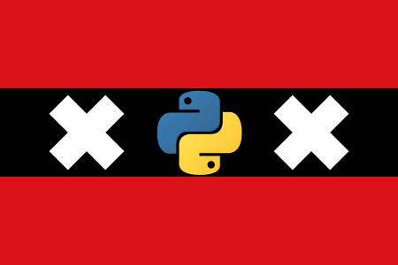
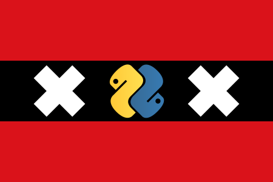

==========
py-meetups
==========

Repository to help us manage meetups of Pyamsterdam https://www.meetup.com/PyAmsterdam/

Proposing a talk
----------------

 * Choose an event from the `events` directory.
 * Describe your talk in `talk-proposalN.md`. 
 * Commit description to a new branch
 * Create a pull request

 
 Logo
----

1. Amsterdam flag with normal python logo.

   
   
2. Amsterdam flag with python logo rotated 45 degrees.

   
   
3. Amsterdam flag with python logo rotated 45 degrees.

   
4. Amsterdam flag with normal python logo only 1 cross changed.

   
   
5. Amsterdam flag with normal python logo only 1 cross changed and rotated 45 degrees.

   
6. Amsterdam flag with normal python logo only 1 cross changed and rotated 45 degrees.

.. image:: resources/images/pyAmsterdam-1-45L.svg
   :alt: Logo normal 45 python
