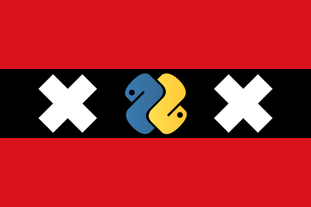

==========
py-meetups
==========

Repository to help us manage meetups of Pyamsterdam https://www.meetup.com/PyAmsterdam/

Proposing a talk
----------------

* Choose an event from the `events` directory.
* Describe your talk in `talk-proposalN.md`. 
* Commit description to a new branch
* Create a pull request

 
Logo
----

.. |logo2| image:: resources/images/pyAmsterdam-45.svg
   :scale: 50%
   :align: top
.. |logo3| image:: resources/images/pyAmsterdam-45R.svg
   :scale: 100%
   :align: middle
.. |logo4| image:: resources/images/pyAmsterdam-1.svg
   :scale: 50%
   :align: top
.. |logo5| image:: resources/images/pyAmsterdam-1-45L.svg
   :scale: 100%
   :align: middle
.. |logo6| image:: resources/images/pyAmsterdam-1-45R.svg
   :scale: 50%
   :align: top
   
+-----------+-----------+
| 1 |logo1| | 4 |logo4| |
+-----------+-----------+
| 2 |logo2| | 5 |logo5| |
+-----------+-----------+
| 3 |logo3| | 6 |logo6| |
+-----------+-----------+
